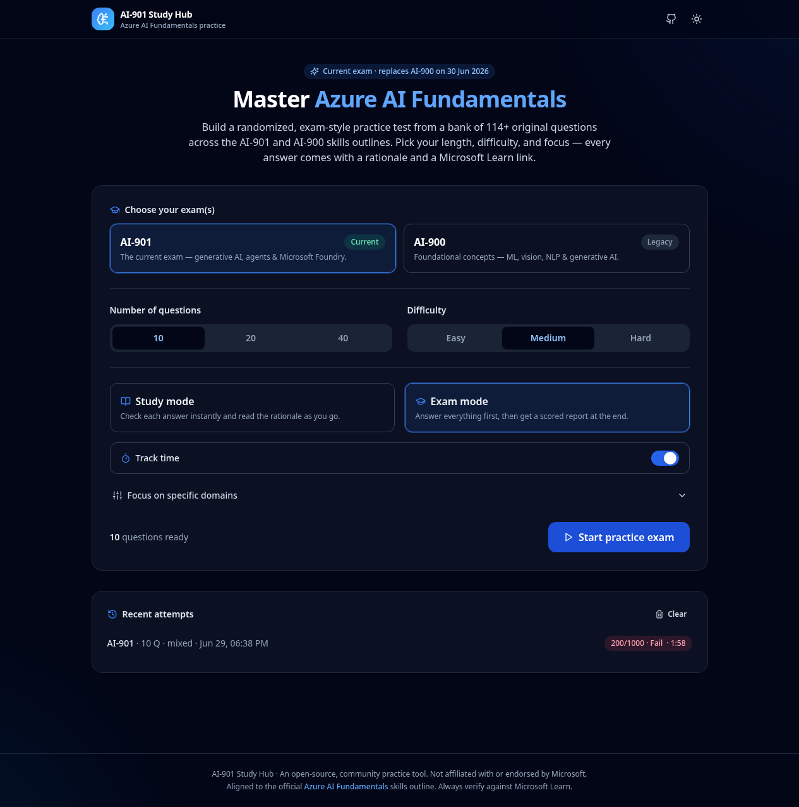

<div align="center">

# 🧠 AI-901 Study Hub

### Interactive practice exams for **Microsoft Certified: Azure AI Fundamentals**

Build randomized, exam-style practice tests from a bank of 100+ original questions across the **AI-901** (current) and **AI-900** (legacy) skills outlines — with instant rationales, Microsoft Learn links, difficulty levels, and per-domain scoring.

<!-- Status badges -->
[](https://github.com/kinect1things/ai-901/actions/workflows/ci.yml)
[](https://github.com/kinect1things/ai-901/actions/workflows/deploy.yml)
[](https://github.com/kinect1things/ai-901/actions/workflows/codeql.yml)
[](https://github.com/kinect1things/ai-901/actions/workflows/dependency-review.yml)

<!-- Project badges -->
[](https://kinect1things.github.io/ai-901/)
[](./LICENSE)
[](./.github/dependabot.yml)
[](./CONTRIBUTING.md)
[](https://github.com/kinect1things/ai-901/commits/main)
[](https://github.com/kinect1things/ai-901/issues)

<!-- Tech badges -->
[](https://react.dev)
[](https://www.typescriptlang.org)
[](https://vite.dev)
[](https://tailwindcss.com)
[](https://vitest.dev)

**▶ [Try it live](https://kinect1things.github.io/ai-901/)**



</div>

---

## Why AI-901?

Microsoft retires **AI-900** on **30 June 2026** and replaces it with **AI-901** — both earn the same *Microsoft Certified: Azure AI Fundamentals* credential. AI-901 is restructured around **generative AI, agents, and Microsoft Foundry**:

| Exam | Domains | Status |
| --- | --- | --- |
| **AI-901** | Identify AI concepts and capabilities (40–45%) · Implement AI solutions by using Microsoft Foundry (55–60%) | ✅ Current |
| **AI-900** | AI workloads & responsible AI · Machine learning · Computer vision · NLP · Generative AI | 🗄️ Legacy (great foundation) |

This app makes **AI-901 the default** and keeps the full **AI-900** bank as foundational study material. Domain names and weightings mirror the official Microsoft Learn study guides.

## Features

- 🎲 **Randomized practice exams** — pick **10 / 20 / 40** questions; AI-901-only blueprints are sampled *weighted by domain percentage* to mirror the real exam mix.
- 🎚️ **One difficulty per test** — **Easy / Medium / Hard**. Difficulty comes from scenario complexity and closer distractors, never out-of-scope knowledge (these are *fundamentals* exams). The difficulty of the question you're on is hidden until you've answered.
- 🧩 **Authentic question formats** — single-choice, multiple-response ("select two…", scored strictly), and Yes/No statement series, written in Microsoft's scenario style.
- 📚 **Study mode vs. Exam mode** — get instant feedback per question, or answer everything and receive a scored report.
- 🧠 **Every answer is explained** — a rationale plus a link to the relevant **Microsoft Learn** module or doc.
- 📊 **Exam-style scoring** — results scaled to **1000** with the official **700** pass mark, plus a **per-domain performance breakdown** so you know what to study next.
- 🧭 **Full session controls** — progress bar, timer, flagging, a question navigator, and keyboard navigation.
- 🕘 **Local history** — recent attempts and your last setup are remembered in your browser (nothing leaves your device).
- 🌗 **Polished, responsive UI** — dark/light themes, accessible controls, Azure-inspired design.

## Question bank

100+ original questions across both exams and all domains, validated on every build:

```
By exam:        AI-901 · AI-900
By difficulty:  easy · medium · hard
By type:        single · multiple-response · statement-series
```

Run `npm run validate:bank` to print live stats and verify integrity. Questions are **original** (no exam dumps) and reference only verified Microsoft Learn URLs.

## Tech stack

**React 18** + **TypeScript** + **Vite** + **Tailwind CSS**, tested with **Vitest** + Testing Library, deployed to **GitHub Pages** via GitHub Actions. No backend — the site is fully static and client-side.

## Getting started

```bash
git clone https://github.com/kinect1things/ai-901.git
cd ai-901
npm install
npm run dev          # http://localhost:5173
```

| Script | Description |
| --- | --- |
| `npm run dev` | Start the Vite dev server |
| `npm run build` | Type-check and build the production bundle |
| `npm run preview` | Preview the production build locally |
| `npm test` | Run unit tests (Vitest) |
| `npm run lint` | Lint with ESLint |
| `npm run typecheck` | Type-check with `tsc` |
| `npm run validate:bank` | Validate question-bank integrity + print stats |

## Project structure

```
src/
├─ data/
│  ├─ exams.ts            # exam metadata + official domain blueprints
│  ├─ references.ts       # verified Microsoft Learn links (by key)
│  ├─ raw-types.ts        # typed authoring schema (build-time validated)
│  └─ questions/          # the question bank, one file per exam-domain
├─ lib/
│  ├─ types.ts            # core domain model
│  ├─ rng.ts              # seeded PRNG + weighted sampling
│  └─ quiz.ts             # build / grade / score engine
├─ hooks/                 # useQuizSession, useTheme
└─ components/            # ConfigScreen, QuizScreen, QuestionView, ResultsScreen…
scripts/validate-bank.ts  # CI question-bank validator
```

## CI/CD & security

`main` is a **protected branch**. Every change flows through a pull request that merges automatically once checks pass — no manual approval required.

- **CI** (`ci.yml`) — lint, type-check, bank validation, unit tests, and build on every PR.
- **Deploy** (`deploy.yml`) — builds and publishes to GitHub Pages on every push to `main`.
- **CodeQL** (`codeql.yml`) — static security analysis on push, PR, and weekly.
- **Dependency Review** (`dependency-review.yml`) — blocks PRs that introduce high-severity vulnerable dependencies.
- **Dependabot** — weekly grouped dependency + GitHub Actions updates, auto-merged once CI is green.

See [CONTRIBUTING.md](./CONTRIBUTING.md) to add questions and [SECURITY.md](./SECURITY.md) for the security policy.

## Disclaimer

This is an independent, open-source community study tool. It is **not affiliated with, authorized, or endorsed by Microsoft**. "Microsoft", "Azure", and exam names are trademarks of Microsoft. All questions are original and written to the public skills outlines — always verify against [Microsoft Learn](https://learn.microsoft.com/en-us/credentials/certifications/azure-ai-fundamentals/).

## License

[MIT](./LICENSE) © 2026 kinect1things
